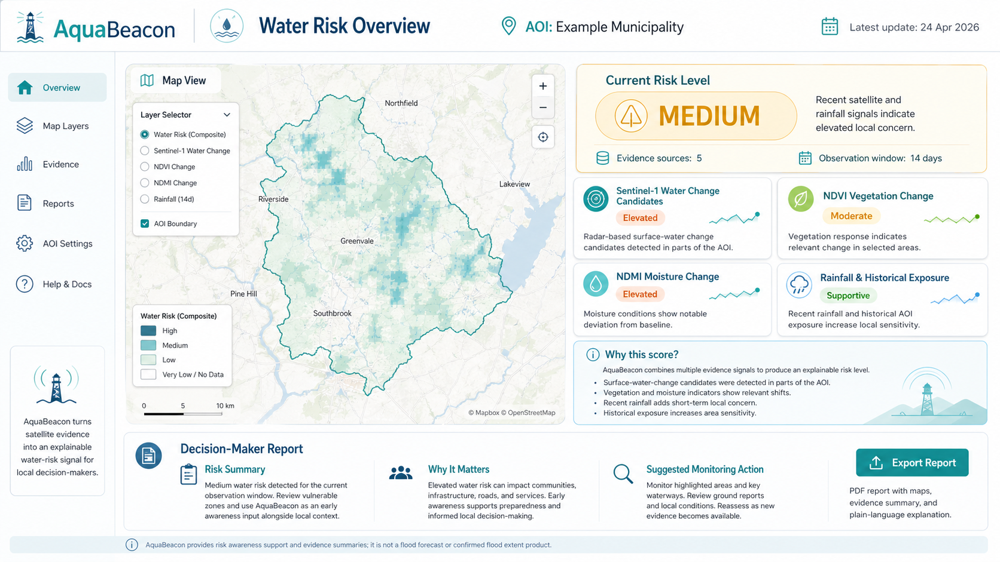

# AquaBeacon
## Dashboard Preview



**AquaBeacon** is a lightweight Copernicus-based early-warning MVP for water-related environmental risk.

It combines Sentinel-1, Sentinel-2, rainfall input, and historical AOI exposure into a simple, explainable **Low / Medium / High** risk signal shown in a Streamlit dashboard.

The goal is not to replace official flood models or emergency systems. AquaBeacon demonstrates how satellite-derived evidence layers can support faster local awareness during water-related stress events.

---

## Why AquaBeacon?

Local decision-makers often need a fast, understandable overview of environmental stress before deeper expert analysis is available.

AquaBeacon turns precomputed Copernicus-based indicators into:

- a clear risk level,
- visual evidence layers,
- a short explanation of the detected signals,
- and a downloadable decision-maker report.

This makes the prototype useful for disaster-risk monitoring, early awareness, and local resilience planning.

---

## What this MVP demonstrates

- A Python-based backend workflow using Copernicus-related satellite indicators.
- Sentinel-1 surface-water-change candidate layers.
- Sentinel-2 vegetation and moisture change indicators.
- Rainfall and historical AOI exposure inputs.
- Transparent rule-based scoring.
- A Streamlit dashboard for non-technical users.
- Downloadable quick reports for each AOI/event.

---

## Demo samples

The repository includes four prepared demo cases:

| Sample | Purpose | Expected signal |
|---|---:|---:|
| Budapest Parliament — Control | No-flood baseline case | Low |
| Budapest Parliament — September 2024 flood event | Known Danube flood context | Medium |
| Houston — Control | Pre-Beryl no-flood comparison | Low |
| Houston — Hurricane Beryl impact | Storm-impact sample with extreme rainfall input | High |

The Budapest flood event is intentionally classified as **Medium** because the MVP does not ingest river gauge data, upstream hydrology, or full hydrological routing. This keeps the prototype transparent and avoids overclaiming.

---

## How it works

AquaBeacon uses a simple evidence-based scoring approach.

For each AOI/event, the system reads prepared backend outputs:

- rainfall input,
- Sentinel-1 surface-water-change candidates,
- Sentinel-2 NDVI change,
- Sentinel-2 NDMI change,
- historical exposure context.

These indicators are combined into a rule-based score and converted into a human-readable risk level:

- **Low** — routine monitoring
- **Medium** — review local conditions
- **High** — prioritize monitoring and validation

The satellite maps are evidence layers, not confirmed flood-extent maps.

---

## Dashboard features

The Streamlit dashboard provides:

- overview of all demo samples,
- selected AOI/event risk level,
- key indicator metrics,
- Sentinel-1 / Sentinel-2 evidence previews,
- comparison table for all samples,
- demo health check,
- downloadable Markdown report.

---

## Project structure

```text
.
├── streamlit_app.py
├── requirements.txt
├── events.json
├── logo.png
├── cover.png
├── cover2.png
├── run_aquabeacon_demo.py
├── make_sample_overview.py
├── make_sample_maps.py
├── make_sentinel1_summaries_all.py
├── recompute_prediction_from_files.py
├── download_finished_job.py
└── samples/
    ├── aquabeacon_sample_overview.csv
    ├── aquabeacon_sample_overview.json
    ├── budapest_parliament_aug_2024_no_flood_control/
    ├── budapest_parliament_sep_2024/
    ├── houston_jun_2024_no_flood_control/
    └── houston_beryl_jul_2024/